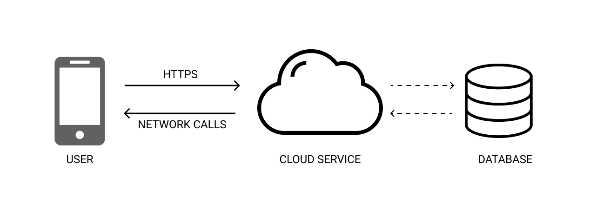
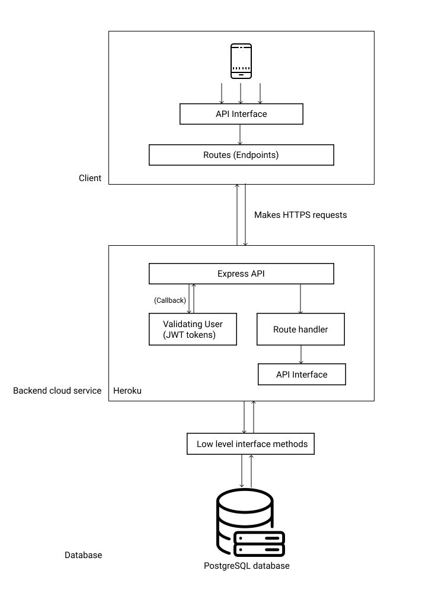
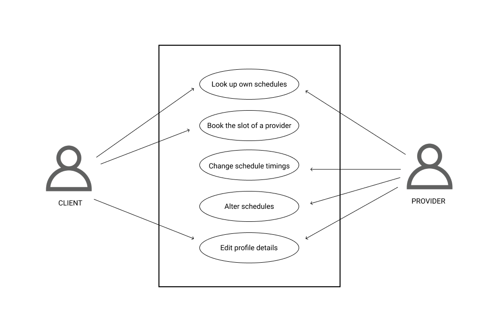

# Calenderly backend

[Calenderly](https://github.com/emilsharier/Calenderly "Calenderly") is an application that is a schedule manager. It allows the user to book a slot in an agent's schedule so that he/she can avail his services according to the schedule.
The API is built using the following tech stack:

    NodeJs
    Express API
    Sequelize
    PostgerSQL

## NOTE

This application is built as a part of 'Amrita University - Campus hiring 21' by Navigus.

## Authentication

The API uses standard email-password method of authentication. However on top of that, each user's session is maintained using a JWT(JSON Web Token). 
A JWT is essentially a ticket which has an expiry time period (customisable) that allows the user to stay connected and access the API interface. A JWT token is basically uncrackable as the server uses a private key to encrypt and hash the token. The token signature is hashed using the client's id. The token will be attached to every response that the client will send to the server. Therefore each request is validated and verified.

## Database

The project uses an ORM (Object relational mapping) tool to access and perform CRUD operations on the databases. The ORM tool used in this project is [Sequelize](https://sequelize.org/ "Sequelize").
The reason behind choosing an ORM over a native database library is portability. This project can be ported to be hooked to MongoDB, MySQL or even SQLite with little to no changes. 
This project is hosted in heroku and the database used is PostgreSQL. The reason behind choosing PostgreSQL was because of the superiority that a relation DB have over a Collection based database

## Architecture

## System design

## DFD

## Endpoints

Following are the end points in the project (to make http & https requests)

#### POST methods
    
    /signin
    /signup
    /changeProviderOccupiedTome
    /bookSchedule
    /viewSchedules
    /fetchLiveSchedules

#### GET methods

    /fetchAllProviders

## Error codes used

    200 - OK
    403 - Unauthorized
    404 - Not found

### Build

The following commands will get you started with building and deploying your project locally

    git clone https://www.github.com/calenderly-backend
    npm install
    npm run dev {for debug}
    npm start {for release}

Also if you're running the project locally make sure to create a .env file which contains the local DATABASE_URL

## Things/Features left out

Features that I had initally planned on implementing but couldn't finish because of the time constraint.

1. To search for a particular provider out of the list
2. Sync with Google calendar